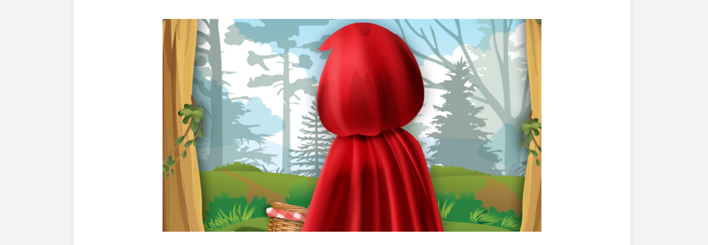

<h1 align="center">📚 Historias-Curtas-WebSite</h1>

<p align="center">
  
</p>

<p align="center">
  
  
  
  
  <a href="https://opensource.org/licenses/MIT">
    
  </a>
</p>


Simple web project that presents **interactive short stories** using HTML pages.
The user can navigate through a menu to choose a story and return to the main menu at any time.

---

## 🗂 Project Structure

```
historias_curtas/
│
├─ assets/media/                         → Image assets used in the project
│
├─ src/
│ ├─ Historia_curta-menu.html            → Main menu page
│ ├─ Historia_curta-historia_1.html      → First short story page
│ └─ Historia_curta-historia_2.html      → Second short story page
│
└─ README.md
```

---

## 📖 How It Works

1. Open `Historia_curta-menu.html` in a web browser.
2. Click on **Story 1** or **Story 2** to read the selected story.
3. To return to the main menu, click the **Back** button at the end of the story.

---

## 🎨 Features

* Interactive menu with links to each story
* Pages with centered text and images
* Simple navigation to return to the main menu

---

## 🖼 Assets

All images used in the project are stored in the `assets/` folder.
Example image used in the **Little Red Riding Hood** story:


---

## 👨‍💻 Authors

Project developed as part of the vocational course  
**Management and Programming of Information Systems (GPSI)**

**School:** Escola Profissional Bento Jesus Caraça (EPBJC)  
**Subject:** PSI  
**Year:** 10th Grade  
**Authors:** Andérson Brito & Rodrigo Silva

---

## License

This project is licensed under the MIT License.
See the [LICENSE](LICENSE) file for more details.
